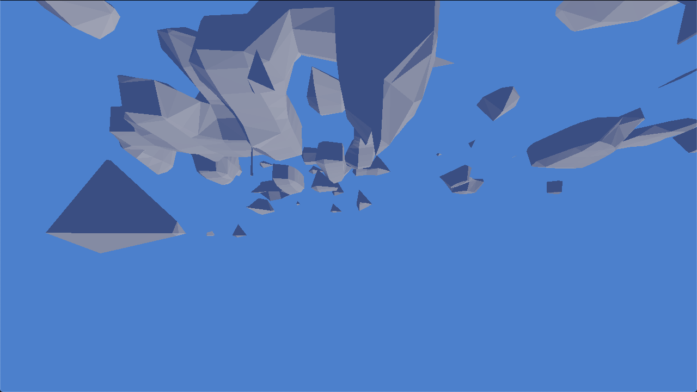

# cubnature

Graffathon 06/2019

## Team

- music - [hyrtsi](https://github.com/hyrtsi)
- music - [keksi](https://github.com/ketoni)
- code - [lehdari](https://github.com/lehdari)
- code, graphics, direction - [sndels](https://github.com/sndels)
- code, graphics - [tkln](https://github.com/tkln)

## [(skunkwork)](https://github.com/sndels/skunkwork) Dependencies
Building requires OpenGL dev libraries and glfw-dependencies. BASS is included as
a dynamic library under its non-commercial license, while GLFW3, imgui, Rocket and
gl3w are submodules with their respective licenses.

## Building 
`cd build && cmake -DCMAKE_BUILD_TYPE=Release .. && make -j9 && cp ../sync/*.track . && ./cubnature`

